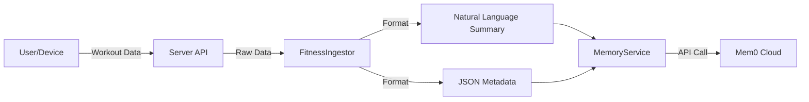

# Resonate Health - Memory Layer Explanation

## 1. High-Level Architecture

The Memory Layer in Resonate Health is designed to give the AI "long-term memory" about the user. It moves beyond simple chat history by storing structured, semantic facts that can be retrieved based on relevance, not just recency.

We use **Mem0** (an external managed memory service) as the core backend.

### Core Components
1.  **Memory Schema**: Defines *what* we store (9 categories like `fitness.training`, `nutrition.intake`, etc.).
2.  **MemoryService**: The central gateway (`Resonate-Server/src/services/memory.service.js`) that wraps the Mem0 API.
3.  **Push Mechanisms (Ingestors)**: Services that "write" to memory when events happen (e.g., finishing a workout).
4.  **Fetch Mechanisms (Context Builder)**: Services that "read" from memory to build context for the AI before it generates advice.

---

## 2. The "Push" Mechanism (Saving Memory)

Memory is "pushed" into the system whenever a significant event occurs. This is not a passive log; it is an active extraction of facts.

### Flow
`User Action` -> `Ingestor Service` -> `Data Processing` -> `MemoryService.addMemory()` -> `Mem0 API`

### Example 1: Finishing a Workout
When a user finishes a workout, the `FitnessIngestor` (`Resonate-Server/src/services/ingestors/fitness.ingestor.js`) handles it:

1.  **Trigger**: `processWorkoutEvent(userId, workout)` is called.
2.  **Extract**: Detailed workout data (sets, reps, RPE) is extracted.
3.  **Format Text**: A natural language summary is created for semantic search.
    *   *Example*: "Completed Push Day: 18 sets, 52 mins, RPE 8. Exercises: Bench Press 4x8..."
4.  **Format Metadata**: Structured data is attached for filtering.
    *   `category`: "fitness.training"
    *   `module_specific`: `{ rpe: 8, duration_mins: 52, ... }`
5.  **Push**: Calls `memoryService.addMemory()`.

### Example 2: Creating an Intervention
When the Coach (or AI) creates a new plan, `InterventionService` (`Resonate-Server/src/services/intervention.service.js`) saves it:

1.  **Save to DB**: The intervention is saved to MongoDB (our operational DB).
2.  **Push to Memory**: Simultaneously, a memory is created so the AI "knows" about this active plan.
    *   *Text*: "Intervention: Increase sleep to 7-8h... Reason: Low recovery."
    *   *Category*: "intervention.plan"

---

## 3. The "Fetch" Mechanism (Retrieving Memory)

Memory is "fetched" primarily when we need to generate AI advice. We don't just dump everything; we search for what's relevant to the current user intent.

### Flow
`User/System Request` -> `MemoryContextBuilder` -> `MemoryService.searchMemory()` -> `Structured Context` -> `Microservice (LLM)`

### Key Component: `MemoryContextBuilder`
Located in `Resonate-Server/src/services/memory/memoryContext.builder.js`, this service decides what to fetch based on the **Intent**.

#### Scenario: User asks for a "Fitness Plan"
1.  **Identify Intent**: `intent = 'fitness_plan'`
2.  **Parallel Searches**:
    *   *Search 1*: "workout training session" (Category: `fitness.training`) -> Gets recent workout history.
    *   *Search 2*: "sleep stress recovery" (Category: `recovery.sleep`) -> Gets recovery context.
    *   *Search 3*: "active training intervention" (Category: `intervention.plan`) -> Checks if user is already on a plan.
3.  **Synthesize**: The builder combines these results into a JSON object (`context`) containing:
    *   `recent_events`: List of memory texts.
    *   `trends`: Calculated metrics (e.g., Average RPE from the last 5 workouts).
    *   `active_interventions`: Any rules the AI must follow.
4.  **Usage**: This `context` is sent to the Microservice prompting the LLM.

---

## 4. Data Structure (The Schema)

Every memory consists of two parts: **Text** (for the LLM to read) and **Metadata** (for the code to filter).

### The 9 Categories
| Category | Purpose | Example Data |
| :--- | :--- | :--- |
| `fitness.training` | Workouts | RPE, Volume, Exercises |
| `nutrition.intake` | Meals | Calories, Macros, Adherence |
| `recovery.sleep` | Sleep | Duration, Quality Score |
| `recovery.stress` | Stress | Stress Score, Fatigue |
| `diagnostics.blood` | Lab Tests | LDL, HbA1c, Vitamin D |
| `diagnostics.bca` | Body Comp | Body Fat %, Muscle Mass |
| `diagnostics.cgm` | Glucose | Fasting Avg, Spikes |
| `intervention.plan` | Active Plans | "Eat more protein" |
| `intervention.outcome` | Results | "Protein plan successful" |

### Metadata Example
```json
{
  "category": "fitness.training",
  "source": "user_input",
  "timestamp": "2026-01-31T07:30:00Z",
  "module_specific": {
    "workout_type": "push",
    "rpe": 8,
    "duration_mins": 52
  }
}
```

## 5. Visual Flow

### Push (Writing)


### Fetch (Reading)
```mermaid
graph LR
    Request[Generate Request] --> Builder[MemoryContextBuilder]
    Builder -->|Intent: Fitness| Search1[Search: 'Training']
    Builder -->|Intent: Fitness| Search2[Search: 'Recovery']
    Search1 & Search2 --> Service[MemoryService]
    Service -->|Query| Mem0[Mem0 Cloud]
    Mem0 -->|Results| Builder
    Builder -->|Synthesized Context| LLM[Microservice / OpenAI]

## 6. Detailed Interaction Log

This section details exactly *when* memory is pushed and fetched, and *which* categories are involved in each event.

### 6.1. Push Events (Writing to Memory)

| Event / Trigger | Triggered By (Service) | Memory Category | Data Stored |
| :--- | :--- | :--- | :--- |
| **Workout Completed** | `FitnessIngestor` | `fitness.training` | Exercises, RPE, Volume, Duration |
| **Meal Logged** | `NutritionIngestor` | `nutrition.intake` | Calories, Macros (P/C/F), Adherence |
| **Sleep Data Synced** | `RecoveryIngestor` | `recovery.sleep` | Duration, Quality, Interruptions |
| **Stress Input** | `RecoveryIngestor` | `recovery.stress` | Stress Score, Fatigue, Sollness |
| **Blood Report Upload** | `DiagnosticsIngestor` | `diagnostics.blood` | Biomarkers (LDL, Vit D, etc.) |
| **BCA Scan Upload** | `DiagnosticsIngestor` | `diagnostics.bca` | Weight, Body Fat %, Muscle Mass |
| **CGM Data Sync** | `DiagnosticsIngestor` | `diagnostics.cgm` | Avg Glucose, Spikes, Time in Range |
| **Intervention Created** | `InterventionService` | `intervention.plan` | Plan details, Reason, Start Date |
| **Intervention Outcome** | `InterventionService` | `intervention.outcome` | Success/Fail, Final Metric |
| **Intervention Stopped** | `InterventionService` | `intervention.outcome` | Reason for stopping |
| **Manual Admin Add** | `MemoryController` | *Any* | *Manual Entry* |

### 6.2. Fetch Events (Reading from Memory)

The AI retrieves memory when building context for specific **Intents**.

#### 1. Intent: `fitness_plan`
*When: User asks for a new workout plan.*
*   **Fetches**:
    *   `fitness.training` (Last 5 logs) -> To gauge current fitness/volume.
    *   `recovery.sleep` (Last 5 logs) -> To check if user is rested.
    *   `recovery.stress` (Last 3 logs) -> To check if user is burnt out.
    *   `intervention.plan` (Active) -> To ensure plan aligns with long-term goals.

#### 2. Intent: `nutrition_plan`
*When: User asks for a meal plan.*
*   **Fetches**:
    *   `nutrition.intake` (Last 10 logs) -> To see recent eating habits/adherence.
    *   `intervention.plan` (Active) -> To check for diet restrictions/goals.

#### 3. Intent: `insights`
*When: User asks "How am I doing?" or Dashboard analysis.*
*   **Fetches**:
    *   `recovery.sleep` (Last 7 days)
    *   `fitness.training` (Last 7 days)
    *   `nutrition.intake` (Last 14 days)
    *   `diagnostics.blood` (Latest result)
    *   `diagnostics.bca` (Latest result)
    *   `intervention.outcome` (Last 5 outcomes)

## 7. User Interaction (Manual vs. Automatic)

**Q: Does the user have to manually "push" memory?**
**A: No.**

The "Memory Push" is an **invisible side-effect** of normal app usage. The user never sees a "Save to Memory" button.

### 1. Fully Automatic (Zero User Effort)
*   **Device Syncs**: When a wearable (like Oura/Garmin/Apple Watch) syncs sleep or steps, the system automatically ingests it.
*   **Lab Results**: When a PDF is uploaded and parsed, the extracted biomarkers are automatically pushed.
*   **Coach Actions**: When a coach creates a plan, it's automatically saved to the user's memory.

### 2. Embedded in Actions (User logs "Activity")
The user manually logs an *activity*, and the *system* pushes the memory.
*   *User Action*: "I ate a chicken salad." (Logs meal)
*   *System Action*: Creates `nutrition.intake` memory.
*   *User Action*: "I finished my workout." (Completes session)
*   *System Action*: Creates `fitness.training` memory.

### 3. Admin Override (Manual Debugging)
There is a specific Admin Dashboard tool to manually add/edit memories, but this is for **debugging and support only**, not for end-users.
```
